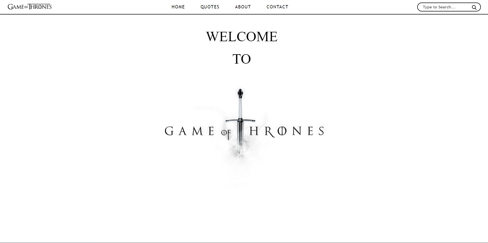
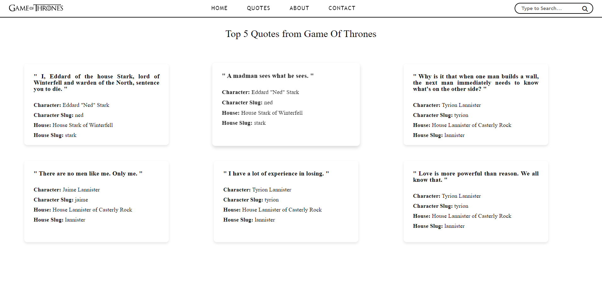
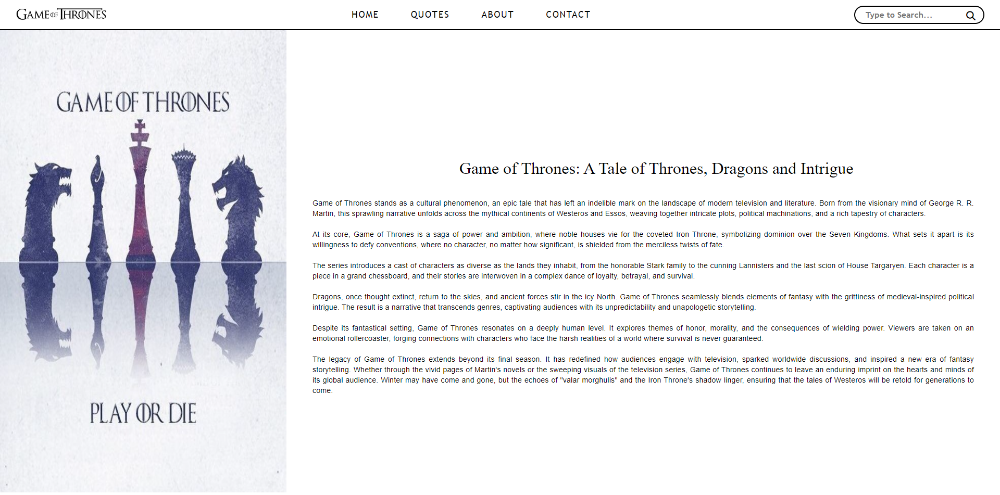
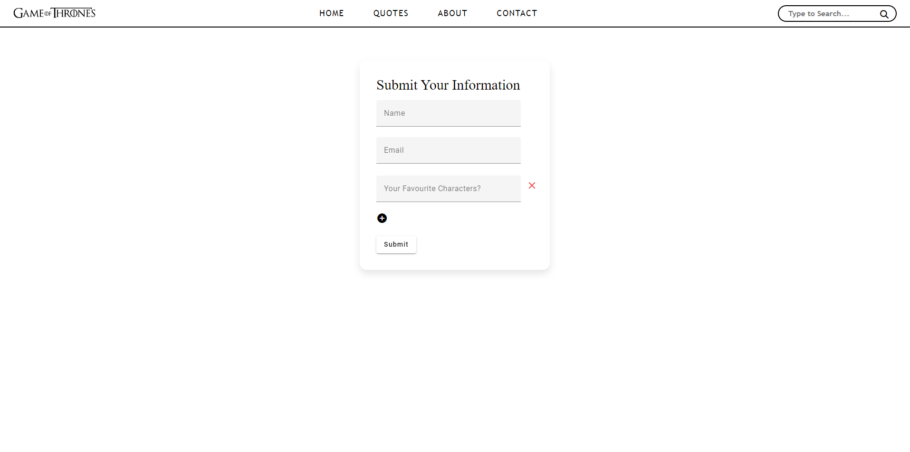

#Task2-Industial Attachment SELISE

 
This is a simple project build using HTML, CSS, Typescript and Angular. It has two key featues that is fetching random quotes from an API and displays them in an elegant card view and a reactive form that allows users to interact with and submit their favourite character of Game Of Thrones.

  

